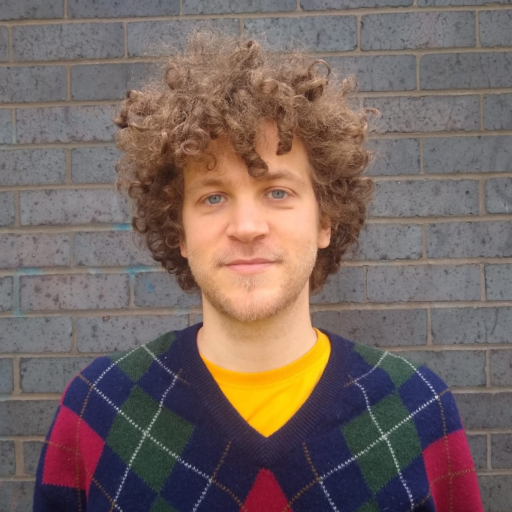
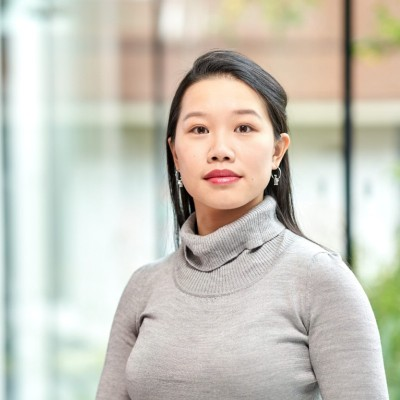
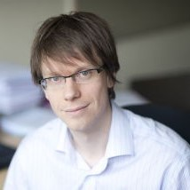

### Lucas Castillo
:::{.columns style="margin-bottom:50px"}
:::{.column-margin}
{width=200 style="border-radius:100%"}
:::
[Lucas](https://www.lucascastillo.net/) is interested in how the mind deals with its own resource limitations to achieve behaviour that is rational enough to navigate the world effectively. Using random generation, he has explored which MCMC algorithms best describe human sampling.
He is the lead developer of the `samplr` package.
:::

### C. Stella Qian
:::{.columns style="margin-bottom:50px"}
:::{.column-margin}
{width=200 style="border-radius:100%"}
:::
Stella is an interdisciplinary researcher incorporating her expertise on vision psychophysics, especially bistable perception and eye movements, with behavioural science and computer science. Currently, she works on developing an experimental paradigm to capture perceptual and decision making features that we can test different computational models on.  
:::

### Adam N. Sanborn
:::{.columns}
:::{.column-margin}
{width=200 style="border-radius:100%"}
:::
[Adam Sanborn](https://profiles.warwick.ac.uk/pssjak-adam-sanborn) is a Professor of [Psychology at the University of Warwick](https://warwick.ac.uk/fac/sci/psych/). Adam is interested in the rationality of human behaviour, which he studies with Bayesian models, sampling approximations to Bayesian models, and behavioural experiments.
:::
