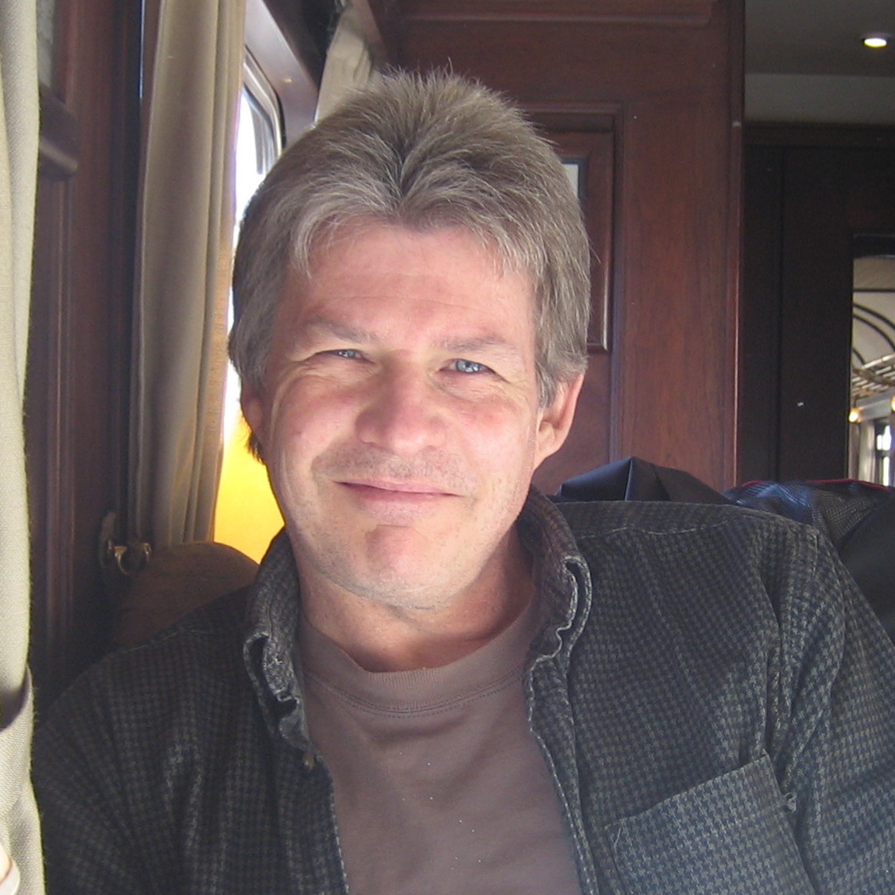

## Organisers
### Lucas Castillo

:::{.columns style="margin-bottom:50px"}
:::{.column-margin}
{width=150 style="border-radius:100%"}
:::
[Lucas](https://www.lucascastillo.net/){target="_blank"} is interested in how the mind deals with its own resource limitations to achieve behaviour that is rational enough to navigate the world effectively. Using random generation, he has explored which MCMC algorithms best describe human sampling.
He is the lead developer of the `samplr` package.
:::

### C. Stella Qian
:::{.columns style="margin-bottom:50px"}
:::{.column-margin}
{width=150 style="border-radius:100%"}
:::
Stella is an interdisciplinary researcher incorporating her expertise on vision psychophysics, especially bistable perception and eye movements, with behavioural science and computer science. Currently, she works on developing an experimental paradigm to capture perceptual and decision making features that we can test different computational models on.  
:::

### Adam N. Sanborn
:::{.columns}
:::{.column-margin}
{width=150 style="border-radius:100%"}
:::
[Adam Sanborn](https://profiles.warwick.ac.uk/pssjak-adam-sanborn){target="_blank"} is a Professor of [Psychology at the University of Warwick](https://warwick.ac.uk/fac/sci/psych/){target="_blank"}. Adam is interested in the rationality of human behaviour, which he studies with Bayesian models, sampling approximations to Bayesian models, and behavioural experiments.
:::

## Guest Speakers
### Bob Rehder

:::{.columns style="margin-bottom:50px"}
:::{.column-margin}
{width=150 style="border-radius:100%"}
:::
[Bob Rehder](https://as.nyu.edu/psychology/people/faculty.robert-e-rehder.html/){target="_blank"} is a Professor in the Psychology Department at New York University. His work spans the field of higher order cognition, including topics such as categorization and category learning, causal learning and reasoning, knowledge representation, explanation, skill acquisition, reinforcement learning, and dynamic control. An important strand of his work is mathematical and computational modeling, including the connectionist and probabilistic (a.k.a., rational) models. 
:::
### Neil Bramley

:::{.columns style="margin-bottom:50px"}
:::{.column-margin}
{width=150 style="border-radius:100%"}
:::
[Neil](https://www.bramleylab.ppls.ed.ac.uk/member/neil/){target="_blank"} is a Reader in Cognitive Psychology at the University of Edinburgh. He studies how people represent and incrementally revise their causal models of world, plus how they use these models (boundedly and imperfectly) to plan, imagine, explain, blame and solve problems. He generally uses interactive experiments and games combined with computational modelling to investigate these issues. In recent work, Neil is using sequential sampling over programs as a framework for understanding both creative thinking and collective innovation.
:::